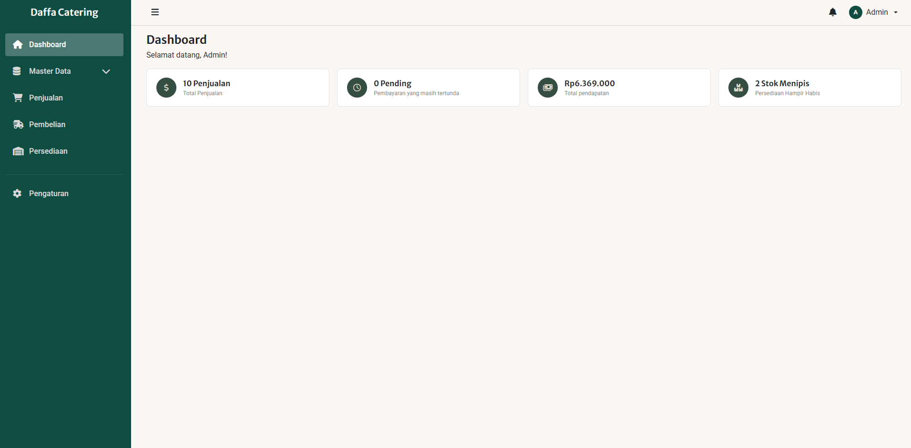
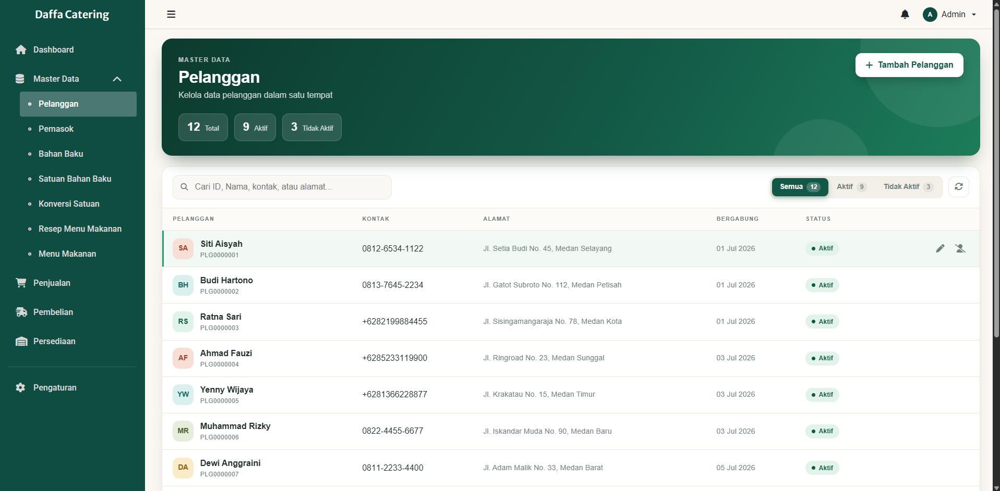
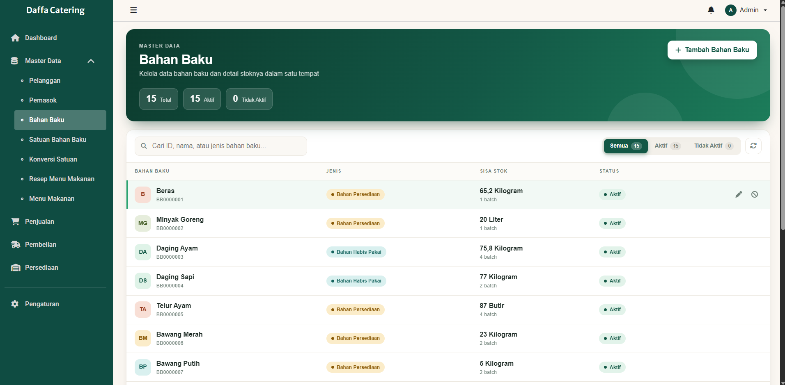
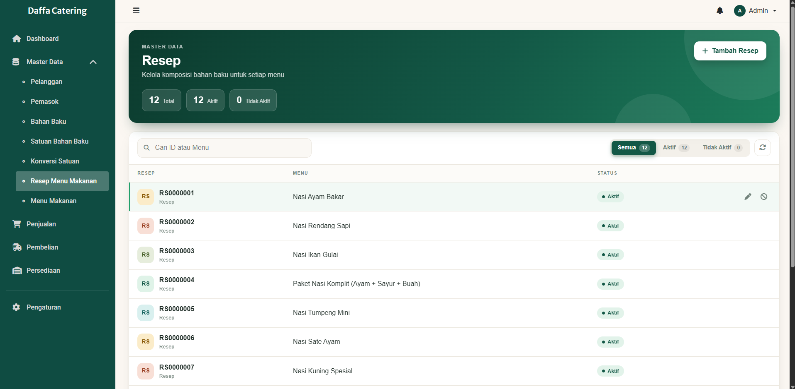

# DaffaCatering

A catering business management system rebuilt from a legacy desktop application (WinForms / .NET Framework) into a modern web architecture: an **ASP.NET Core Web API** backend with a **Blazor** frontend.

Originally developed as my Information Systems thesis project, this is an advanced iteration that separates business logic from the UI, so the same API can serve web, mobile, or desktop clients.

> **Status:** under active development. The backend is feature-complete for the core business flow; the Blazor UI currently covers authentication, the dashboard, and master data. See the [Roadmap](#roadmap).

## Screenshots

| Dashboard | Customers |
|---|---|
|  |  |

| Raw Materials | Recipes |
|---|---|
|  |  |

## Features

### Backend (ASP.NET Core Web API)
- RESTful CRUD endpoints for master data and transactions
- JWT authentication with BCrypt password hashing
- Role-based authorization with 4 roles: `Admin`, `Penjualan` (Sales), `Pembelian` (Purchasing), `Persediaan` (Inventory)
- Business flow: purchase → goods receipt → stock usage / adjustment → recipe → order → sale
- Batch-based inventory using **FEFO** (First Expired, First Out), with automatic stock deduction when a sale consumes recipe ingredients
- Recipes modeled as a bill of materials (BOM), with unit conversion between raw material units
- Header-detail transaction design across 21 tables, organized by schema (`BahanBaku`, `Pembelian`, `Resep`, `Penjualan`)
- Swagger / OpenAPI documentation

### Frontend (Blazor)
- Login page and dashboard (sales count, pending payments, revenue, low-stock alerts)
- Master data pages: Customers, Suppliers, Raw Materials, Raw Material Units, Unit Conversions, Recipes, Menu Items
- Search, status filters (All / Active / Inactive), and auto-generated IDs (e.g. `PLG0000001`)
- Master data is never hard-deleted; records are set to Inactive to preserve transaction history

## Tech Stack

| Layer | Technology |
|---|---|
| Language | C# |
| Backend | ASP.NET Core Web API (.NET 10) |
| ORM | Entity Framework Core (Database First) |
| Database | SQL Server |
| Frontend | Blazor |
| Auth | JWT Bearer, BCrypt |
| API Docs | Swagger / OpenAPI |

## Architecture

```
DaffaCatering.Blazor  ──HTTP/JSON──►  DaffaCatering.API  ──EF Core──►  SQL Server
   (UI only)                          (business logic,                (DaffaCateringDB)
                                       auth, data access)
```

All business logic and data access live in the API. The Blazor project only renders the UI and consumes the API over HTTP.

## Getting Started

### Prerequisites
- [.NET 10 SDK](https://dotnet.microsoft.com/download)
- SQL Server (LocalDB, Express, or full) and SQL Server Management Studio
- Visual Studio 2022+ or the `dotnet` CLI

### 1. Create the database
Open `database/DaffaCateringDB.sql` in SQL Server Management Studio and run it. It creates `DaffaCateringDB` with the schema and sample (dummy) data.

### 2. Configure the connection string
The default in `DaffaCatering.API/appsettings.json` uses Windows Authentication on `localhost`:

```
Server=localhost;Database=DaffaCateringDB;Trusted_Connection=True;TrustServerCertificate=True;
```

Change it if your SQL Server instance is different.

### 3. Set the JWT signing key
The key is intentionally **not** stored in the repository. Set it with .NET User Secrets (never commit real values):

```bash
cd DaffaCatering.API
dotnet user-secrets init
dotnet user-secrets set "Jwt:Key" "<random-string-of-at-least-32-characters>"
```

### 4. Run the API
```bash
cd DaffaCatering.API
dotnet run
```
Open the HTTPS address shown in the console, then go to `/swagger`.

### 5. Run the Blazor frontend
Make sure `ApiBaseUrl` in `DaffaCatering.Blazor/appsettings.json` matches the API's HTTPS address, then:

```bash
cd DaffaCatering.Blazor
dotnet run
```

### Demo accounts
| Username | Password | Role |
|---|---|---|
| `admin` | `<demo-password>` | Admin |

> Sample data and demo credentials are for local development only.

## Roadmap
- [x] Backend: master data, purchasing, receiving, usage/adjustment, recipes, orders, sales
- [x] JWT authentication and role-based authorization
- [x] Blazor: login, dashboard, master data pages
- [ ] Blazor: Sales, Purchasing, and Inventory transaction pages
- [ ] Operational reports
- [ ] Automated tests (xUnit)
- [ ] Online deployment

## Author
**Daffa Shiddiq Hidayat**, Information Systems graduate.
Built as a personal portfolio project, based on the concept of my thesis project.

## License
Released under the [MIT License](LICENSE).
